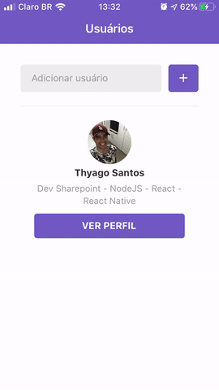

# Github Users Repo

Add GitHub users and see their starred repos with React native + Expo

### Demo



## :rocket: Technologies

This project was developed with the following technologies:

- [Expo](https://docs.expo.io/versions/latest/)
- [React Native](http://facebook.github.io/react-native/)
- [React Navigation](https://reactnavigation.org/)
- [React Native Gesture Handler](https://kmagiera.github.io/react-native-gesture-handler/)
- [styled-components](https://www.styled-components.com/)
- [react-native-vector-icons](https://oblador.github.io/react-native-vector-icons/)
- [react-native-qrcode](https://www.npmjs.com/package/react-native-qrcode)
- [styled-components](https://www.styled-components.com/)
- [Axios]
- [Async Storage]
- [VS Code] with [EditorConfig] and [ESLint]

## :information_source: How To Use

```bash
# Install expo
$ download and install expo app on smartphone

# Clone this repository
$ git clone https://github.com/thyagoaraujo/github-users-react-native.git

# Go into the repository
$ cd github-users-react-native

# Install dependencies
$ yarn install

# Run the app
$ yarn start
$ run expo on smartphone
```

## :memo: License

This project is under the MIT license. See the [LICENSE](https://github.com/thyagoaraujo/github-users-react-native/blob/master/LICENSE.md) for more information.

---

Made with ♥ by Thyago Araujo :wave: [Get in touch!](https://www.linkedin.com/in/thyagosantosaraujo/)
